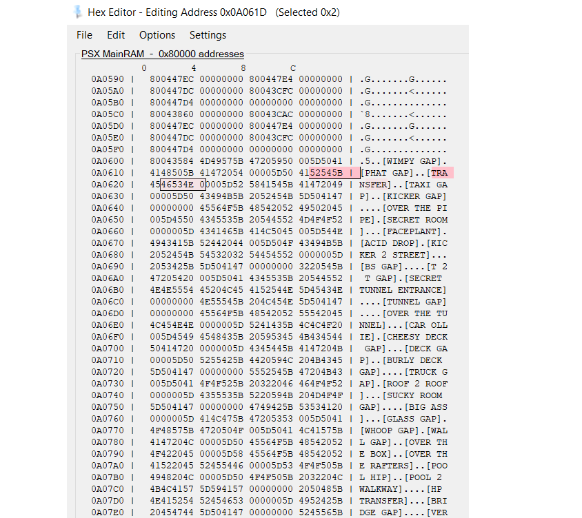

> [!NOTE]
> PARTYMANX has shared his work (cf issue #1), the investigation can now be declared as a case closed.
>
> End results : Only 3 gaps, not reached, seem to exist (200 Feet, 225 Feet, 250 Feet) but the others don't seem to be implemented.
>
> Below, my original investigation.

# Gaps of THPS 1

As mentioned in the [Tony Hawk's fandom wiki](https://tonyhawkgames.fandom.com/wiki/Gap) : `A complete gap list for THPS1 was never released`.

So, how can we be sure that all gaps in THPS 1 have been found ?

## Known Gaps

First, I've searched for websites and videos showing where all the gaps were.

At this time, it's [Psychochotics](https://www.youtube.com/playlist?list=PLarzX6CHWKbTnTMawI2ooS_1Nj0SiUfZg) who is showing more gaps than anyone.

<details>
    <summary>Total gaps / Total unique gaps</summary>

    Total gaps : 134
    Total unique gaps : 127
</details>

## Memory

I decided to search inside the THPS 1 game's memory.

To do so, I used `BizHawk` (the same tool I use to TAS), launched the `Hex Editor` and searched for `TRANSFER`.

It brings me this result.

<details>
    <summary>Search in Hex Editor</summary>


</details>

Hm, it seems that it's where all the gaps name are saved (from address _0x0A0604_).

So, the hypothetical full list of gaps is here (the order is kept, not sorted).

<details>
    <summary>Gaps in memory</summary>

    [WIMPY GAP]
    [PHAT GAP]
    [TRANSFER]
    [TAXI GAP]
    [KICKER GAP]
    [OVER THE PIPE]
    [SECRET ROOM]
    [FACEPLANT]
    [ACID DROP]
    [KICKER 2 STREET]
    [BS GAP]
    [T 2 T GAP]
    [SECRET TUNNEL ENTRANCE]
    [TUNNEL GAP]
    [OVER THE TUNNEL]
    [CAR OLLIE]
    [CHEESY DECK GAP]
    [DECK GAP]
    [BURLY DECK GAP]
    [TRUCK GAP]
    [ROOF 2 ROOF]
    [SUCKY ROOM GAP]
    [BIG ASS]
    [GLASS GAP]
    [WHOOP GAP]
    [WALL GAP]
    [OVER THE BOX]
    [OVER THE RAFTERS]
    [POOL HIP]
    [POOL 2 WALKWAY]
    [HP TRANSFER]
    [BRIDGE GAP]
    [VERT WALL GAP]
    [TWINKIE TRANSFER]
    [OVER DA POOL]
    [ROOF 2 ROOF GAP]
    [SWIM TEAM GAP]
    [AWNING GAP]
    [GARBAGE OLLIE]
    [ROOF TO AWNING GAP]
    [DITCH SLAP]
    [OVER THE AIR CONDITIONER]
    [OVER A FOOTBRIDGE]
    [PARK GAP]
    [MINI GAP]
    [PLANTER GAP]
    [OVER A 16 STAIR SET]
    [OVER A HUGE 32 STAIR GAP]
    [SKATER ESCALATOR GAP]
    [32 STEPS OFF A MEZZANINE]
    [THE FLYING LEAP]
    [RAMP GAP]
    [GOING UP GAP]
    [GOING DOWN GAP]
    [FOUNTAIN GAP]
    [RAGING GORGE GAP]
    [HUGE WATER HAZARD GAP]
    [50 FEET]
    [100 FEET]
    [150 FEET]
    [200 FEET]
    [250 FEET]
    [SMALL WATER HAZARD GAP]
    [BIG WATER HAZARD GAP]
    [25 FEET]
    [75 FEET]
    [125 FEET]
    [175 FEET]
    [225 FEET]
    [RAMP 2 RAMP]
    [LOW DECK GAP]
    [HIGH DECK GAP]
    [PORCH GAP]
    [LOMBARD GAP]
    [THE GONZ GAP]
    [PAGODA GAP]
    [OVER THE SEVEN]
    [HUBBA GAP]
    [STREET GAP]
    [HANDI GAP]
    [C BLOCK GAP]
    [SPINE GAP]
    [OVERSIZED 8 SET]
    [ACID DROP-IN]
    [FOUNTAIN GAP
    [PAGODA HOP]
    [CHANNEL GAP]
    [KICKER 2 LEDGE]
    [FREAKIN POOL GRIND]
    [ROLL IN CHANNEL GAP]
    [HALL PASS GAP]
    [BIG RAIL]
    [DECK 2 RAIL]
    [TAXI 2 LEDGE]
    [TAXI 2 RAIL]
    [MONSTER GRIND]
    [HIGH RAIL]
    [HOLY SHI...]
    [TRANSITION GRIND]
    [KICKER 2 EDGE]
    [BS GRIND]
    [RAIL 2 RAIL TRANSFER]
    [BILLBOARD GRIND]
    [DIRTY RAIL]
    [DEATH GRIND]
    [TRIPLE RAIL]
    [BRIDGE GRIND]
    [HAWK BRIDGE GRIND]
    [RAFTER RAIL]
    [PIPE 2 BOX GRIND]
    [LIGHT GRIND]
    [WALKWAY RAIL TRANS]
    [POOL RAIL TRANS]
    [ET GRIND]
    [BHOUSE RAIL]
    [POOL GRIND]
    [DECK GRIND]
    [MB EMERSON GRIND]
    [DUMPSTER RAIL GAP]
    [PLAYGROUND RAIL]
    [RAIL TO RAIL TRANSFER]
    [HUGE RAIL]
    [LONG ASS RAIL]
    [FUNBOX TO RAIL TRANSFER]
    [FUNBOX TO TABLE TRANSFER]
    [GIMME GAP]
    [HANDICAP RAMP RAIL]
    [COFFEE GRIND]
    [FOR THE WHOLE ATRIUM]
    [RAIL COMBO]
    [NEVERSOFT ELEC CO GAP]
    [DOWN THE SPIRAL]
    [LOMBARD LEDGE]
    [HUBBA LEDGE]
    [HOOK RAIL]
    [RAIL 2 RAIL]
    [BACKWOODS LEDGE]
    [BENDY'S LIP]
    [ARE YOU KIDDING?]
</details>

Now, if I match those gaps with the Psychochotics's ones, it gives this :

<details>
    <summary>Gaps in memory matched with Psychochotics's gaps</summary>

    [WIMPY GAP] => Downtown
    [PHAT GAP] => Downtown
    [TRANSFER] => Warehouse, Skate Park, Downtown, Burnside
    [TAXI GAP] => Warehouse
    [KICKER GAP] => Warehouse, School, Downtown
    [OVER THE PIPE] => Warehouse, Skate Park
    [SECRET ROOM] => Warehouse
    [FACEPLANT] => Warehouse
    [ACID DROP] => Skate Park
    [KICKER 2 STREET] => Downtown
    [BS GAP] => Downtown
    [T 2 T GAP] => Downtown
    [SECRET TUNNEL ENTRANCE] => Downtown
    [TUNNEL GAP] => Downtown
    [OVER THE TUNNEL] => Downtown
    [CAR OLLIE] => Downtown
    [CHEESY DECK GAP] => Downtown
    [DECK GAP] => Downtown, Roswell
    [BURLY DECK GAP] => Downtown
    [TRUCK GAP] => Downtown
    [ROOF 2 ROOF] => Downtown
    [SUCKY ROOM GAP] => Downtown
    [BIG ASS] => Downtown
    [GLASS GAP] => Downtown
    [WHOOP GAP] => Skate Park
    [WALL GAP] => Skate Park
    [OVER THE BOX] => Skate Park
    [OVER THE RAFTERS] => Skate Park
    [POOL HIP] => Skate Park
    [POOL 2 WALKWAY] => Skate Park
    [HP TRANSFER] => Skate Park
    [BRIDGE GAP] => Burnside
    [VERT WALL GAP] => Burnside
    [TWINKIE TRANSFER] => Burnside
    [OVER DA POOL] => Burnside
    [ROOF 2 ROOF GAP] => School
    [SWIM TEAM GAP] => School
    [AWNING GAP]
    [GARBAGE OLLIE] => School
    [ROOF TO AWNING GAP] => School
    [DITCH SLAP] => School
    [OVER THE AIR CONDITIONER] => School
    [OVER A FOOTBRIDGE] => School
    [PARK GAP] => School
    [MINI GAP] => School
    [PLANTER GAP] => School, Mall, Streets
    [OVER A 16 STAIR SET] => Mall
    [OVER A HUGE 32 STAIR GAP] => Mall
    [SKATER ESCALATOR GAP] => Mall
    [32 STEPS OFF A MEZZANINE] => Mall
    [THE FLYING LEAP] => Mall
    [RAMP GAP]
    [GOING UP GAP] => Mall
    [GOING DOWN GAP] => Mall
    [FOUNTAIN GAP] => Mall, Streets
    [RAGING GORGE GAP]
    [HUGE WATER HAZARD GAP] => Downhill Jam
    [50 FEET] => Downhill Jam
    [100 FEET] => Downhill Jam
    [150 FEET]
    [200 FEET]
    [250 FEET]
    [SMALL WATER HAZARD GAP]
    [BIG WATER HAZARD GAP]
    [25 FEET] => Downhill Jam
    [75 FEET] => Downhill Jam
    [125 FEET]
    [175 FEET]
    [225 FEET]
    [RAMP 2 RAMP] => Streets
    [LOW DECK GAP] => Roswell
    [HIGH DECK GAP] => Roswell
    [PORCH GAP] => Streets
    [LOMBARD GAP] => Streets
    [THE GONZ GAP] => Streets
    [PAGODA GAP] => Streets
    [OVER THE SEVEN] => Streets
    [HUBBA GAP] => Streets
    [STREET GAP] => Streets
    [HANDI GAP] => Streets
    [C BLOCK GAP] => Streets
    [SPINE GAP] => Streets
    [OVERSIZED 8 SET] => Streets
    [ACID DROP-IN] => Streets
    [FOUNTAIN GAP
    [PAGODA HOP]
    [CHANNEL GAP] => Warehouse, Roswell
    [KICKER 2 LEDGE] => Warehouse
    [FREAKIN POOL GRIND]
    [ROLL IN CHANNEL GAP] => Roswell
    [HALL PASS GAP] => School
    [BIG RAIL] => Warehouse
    [DECK 2 RAIL] => Warehouse
    [TAXI 2 LEDGE] => Warehouse
    [TAXI 2 RAIL] => Warehouse
    [MONSTER GRIND] => Warehouse
    [HIGH RAIL] => Warehouse
    [HOLY SHI...] => Warehouse
    [TRANSITION GRIND] => Warehouse
    [KICKER 2 EDGE] => Downtown
    [BS GRIND] => Downtown
    [RAIL 2 RAIL TRANSFER] => Downtown
    [BILLBOARD GRIND] => Downtown
    [DIRTY RAIL] => Downtown
    [DEATH GRIND] => Downtown
    [TRIPLE RAIL] => Burnside
    [BRIDGE GRIND] => Burnside
    [HAWK BRIDGE GRIND]
    [RAFTER RAIL] => Skate Park
    [PIPE 2 BOX GRIND] => Skate Park
    [LIGHT GRIND] => Skate Park
    [WALKWAY RAIL TRANS] => Skate Park
    [POOL RAIL TRANS] => Skate Park
    [ET GRIND] => Roswell
    [BHOUSE RAIL] => Roswell
    [POOL GRIND] => Roswell
    [DECK GRIND] => Roswell
    [MB EMERSON GRIND] => Roswell
    [DUMPSTER RAIL GAP] => School
    [PLAYGROUND RAIL] => School
    [RAIL TO RAIL TRANSFER] => School
    [HUGE RAIL] => School
    [LONG ASS RAIL] => School
    [FUNBOX TO RAIL TRANSFER] => School
    [FUNBOX TO TABLE TRANSFER] => School
    [GIMME GAP] => School
    [HANDICAP RAMP RAIL] => School
    [COFFEE GRIND] => Mall
    [FOR THE WHOLE ATRIUM] => Mall
    [RAIL COMBO] => Mall
    [NEVERSOFT ELEC CO GAP] => Downhill Jam
    [DOWN THE SPIRAL] => Streets
    [LOMBARD LEDGE] => Streets
    [HUBBA LEDGE] => Streets
    [HOOK RAIL] => Streets
    [RAIL 2 RAIL] => Streets
    [BACKWOODS LEDGE] => Streets
    [BENDY'S LIP] => Streets
    [ARE YOU KIDDING?]
</details>

Ah, some gaps seem not found yet. Let's take a look.

<details>
    <summary>Gaps not found yet</summary>

    [AWNING GAP]
    [RAMP GAP]
    [RAGING GORGE GAP]
    [150 FEET]
    [200 FEET]
    [250 FEET]
    [SMALL WATER HAZARD GAP]
    [BIG WATER HAZARD GAP]
    [125 FEET]
    [175 FEET]
    [225 FEET]
    [FOUNTAIN GAP
    [PAGODA HOP]
    [FREAKIN POOL GRIND]
    [HAWK BRIDGE GRIND]
    [ARE YOU KIDDING?]
</details>

## Gaps not found

In the list, we can make some hypotheses :

- Fountain Gap already exists in the list but this one seems to have a typo in its name (the ending square bracket is missing : `[FOUNTAIN GAP` instead of `[FOUNTAIN GAP]`). Hm, this is not a new gap to look for, IMO.
- `125 Feet`, `150 Feet` and `175 Feet` [have already been reached](https://www.youtube.com/watch?v=06ui7wSUs2U&t=99s). The others (`200 Feet` / `225 Feet` / `250 Feet`) not yet but are likely to be on the continuity.

But what about the others gaps not found ?

One thing we can notice in the memory is that the gaps are (almost) all grouped by level.

Can we deduce that way in which level those missing gaps are ? Let's try.

### Awning Gap

```
[ROOF 2 ROOF GAP] => School
[SWIM TEAM GAP] => School
[AWNING GAP]
[GARBAGE OLLIE] => School
[ROOF TO AWNING GAP] => School
[DITCH SLAP] => School
[OVER THE AIR CONDITIONER] => School
[OVER A FOOTBRIDGE] => School
[PARK GAP] => School
[MINI GAP] => School
```

`Awning Gap` could be in `School`.

### Ramp Gap

```
[OVER A 16 STAIR SET] => Mall
[OVER A HUGE 32 STAIR GAP] => Mall
[SKATER ESCALATOR GAP] => Mall
[32 STEPS OFF A MEZZANINE] => Mall
[THE FLYING LEAP] => Mall
[RAMP GAP]
[GOING UP GAP] => Mall
[GOING DOWN GAP] => Mall
```

`Ramp Gap` could be in `Mall`.

### Raging Gorge Gap

```
[RAGING GORGE GAP]
[HUGE WATER HAZARD GAP] => Downhill Jam
[50 FEET] => Downhill Jam
[100 FEET] => Downhill Jam
```

`Raging Gorge Gap` could be in `Downhill Jam`.

### Small Water Hazard Gap / Big Water Hazard Gap

```
[50 FEET] => Downhill Jam
[100 FEET] => Downhill Jam
[150 FEET]
[200 FEET]
[250 FEET]
[SMALL WATER HAZARD GAP]
[BIG WATER HAZARD GAP]
[25 FEET] => Downhill Jam
[75 FEET] => Downhill Jam
[125 FEET]
[175 FEET]
[225 FEET]
```

`Small Water Hazard Gap` and `Big Water Hazard Gap` could be in `Downhill Jam`.

### Pagoda Hop

```
[PORCH GAP] => Streets
[LOMBARD GAP] => Streets
[THE GONZ GAP] => Streets
[PAGODA GAP] => Streets
[OVER THE SEVEN] => Streets
[HUBBA GAP] => Streets
[STREET GAP] => Streets
[HANDI GAP] => Streets
[C BLOCK GAP] => Streets
[SPINE GAP] => Streets
[OVERSIZED 8 SET] => Streets
[ACID DROP-IN] => Streets
[FOUNTAIN GAP
[PAGODA HOP]
```

`Pagoda Hop` could be in `Streets`.

### Freakin Pool Grind

```
[CHANNEL GAP] => Warehouse, Roswell
[KICKER 2 LEDGE] => Warehouse
[FREAKIN POOL GRIND]
[ROLL IN CHANNEL GAP] => Roswell
```

`Freakin Pool Grind` could be in `Roswell` (or in `Skate Park` due to other "Pool" gaps).

### Hawk Bridge Grind

```
[TRIPLE RAIL] => Burnside
[BRIDGE GRIND] => Burnside
[HAWK BRIDGE GRIND]
```

`Hawk Bridge Grind` could be in `Burnside`.

### Are You Kidding?

```
[DOWN THE SPIRAL] => Streets
[LOMBARD LEDGE] => Streets
[HUBBA LEDGE] => Streets
[HOOK RAIL] => Streets
[RAIL 2 RAIL] => Streets
[BACKWOODS LEDGE] => Streets
[BENDY'S LIP] => Streets
[ARE YOU KIDDING?]
```

`Are You Kidding?` could be in `Streets`.

## Are there really some missing gaps ?

As seen above, some gaps are questioning.

Are those missing gaps really implemented in the game ?

Another clue to this investigation is when you search exactly for "Small Water Hazard Gap" (here in Google), only one answer is found : [this code repository](https://github.com/Vadru93/THPS2X-Formats).

It seems that this project dumps the gaps existing in THPS 2x. In this game, the levels of THPS 1 are playable but, as mentioned in the [associated wiki](https://tonyhawkgames.fandom.com/wiki/Tony_Hawk's_Pro_Skater_2X), `Gap checklist only includes THPS2 levels`.

Ok, but the fact that some of those missing gaps are present in the codebase of THPS 2x is really intriguing.

### Missing Gaps vs Gaps in THPS 2x

Missing gaps that are in the dump of THPS 2x

- Raging Gorge Gap
- Small Water Hazard Gap
- Pagoda Hop
- Hawk Bridge Grind
- Are You Kidding?

Missing gaps that are _not_ in the dump of THPS 2x

- Awning Gap
- Ramp Gap
- Big Water Hazard Gap
- Freakin Pool Grind

Does this say that those 5 gaps haven't been found yet in THPS 1 ? Arf, can't say, it's just a clue.

## Conclusion

With this little investigation, I cannot conclude that every gaps in THPS 1 have been found yet.

If you have any additional details, you can create [an issue](https://github.com/fullmoonissue/tony-hawk-pro-skater-1/issues/new) ;-D
